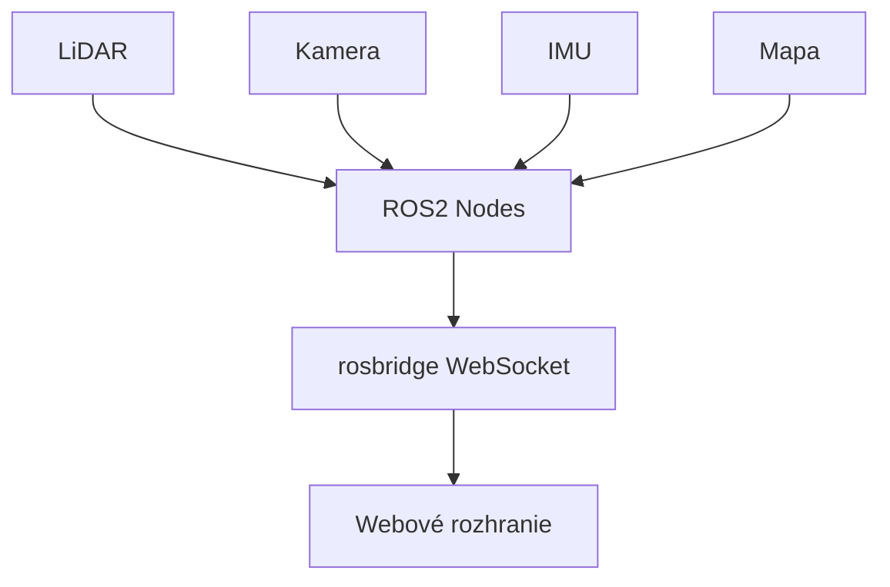

### ROS2 Vizualizačné Webové Rozhranie

V tejto časti sa zameriava na vytvorenie webového vizualizačného rozhrania pre robotický systém využívajúci ROS2. Cieľom je umožniť zobrazovanie dát zo senzorov a mapovanie prostredia priamo vo webovom prehliadači v reálnom čase.

Systém umožňuje:

- vizualizáciu LiDAR dát,
- zobrazenie kamery robota,
- vizualizáciu mapy prostredia,
- komunikáciu medzi ROS2 a webovým rozhraním,
ovládanie a monitoring systému cez webové rozhranie.

Systém pozostáva z backendovej časti -ROS2 a frontendovej aplikácie, ktoré komunikujú cez WebSocket protokol.

* **Backend:** Beží na Ubuntu 22.04 s ROS2 Humble. Uzly (nodes) spracovávajú dáta zo senzorov.
* **Middleware:** Balík `rosbridge_server` zabezpečuje obojsmernú komunikáciu medzi ROS2 a webom.
* **Frontend:** Implementovaný pomocou HTML5, CSS3 a JavaScriptu (knižnica **ROSLIB.js**).

# Architektúra systému



- `pointcloud_publisher/` – Spracovanie surových LiDAR dát pre web.
- `camera_publisher/` – Zachytávanie a kompresia obrazu z kamery.
- `map_builder/` – Tvorba a publikovanie globálnej mapy.
- `web_interface/` – Zdrojové kódy webovej aplikácie (HTML/JS).


# 1. Spustenie rosbridge servera

Webová aplikácia komunikuje s ROS2 pomocou `rosbridge_server`.

Spustenie:

```bash
ros2 launch rosbridge_server rosbridge_websocket_launch.xml
```

---

# 2. Spustenie webovej stránky

Prejdeme do priečinka webového rozhrania a spustíme jednoduchý HTTP server

```bash
cd src/web_interface
python3 -m http.server 8000
```

Webová stránka bude dostupná na: `http://localhost:8000`.
V prípade prístupu z iného zariadenia v sieti (cez JETSON_ORIN): `http://10.42.0.1:8000`.

---
# 3. Spustenie node system_controller

```bash
ros2 run pointcloud_publisher system_controller_node
```

# 4. ROS2 Topics

## PointCloud Publisher Node

Node slúži na spracovanie LiDAR dát a ich publikovanie pre webové rozhranie.

| Topic           | ROS2 Message Type         | Direction  |
| --------------- | ------------------------- | ---------- |
| `/lidar_points` | `sensor_msgs/PointCloud2` | Subscribes |
| `/lidar`        | `sensor_msgs/PointCloud2` | Publishes  |

---

## Camera Publisher Node

Node zabezpečuje prijímanie obrazu z kamery a jeho kompresiu pre webový prenos.

| Topic                      | ROS2 Message Type             | Direction  |
| -------------------------- | ----------------------------- | ---------- |
| `/rgb_img`                 | `sensor_msgs/Image`           | Subscribes |
| `/camera_image/compressed` | `sensor_msgs/CompressedImage` | Publishes  |

---

## Map Builder Node

Node vytvára globálnu mapu prostredia pomocou LiDAR dát a IMU senzora.

| Topic               | ROS2 Message Type         | Direction  |
| ------------------- | ------------------------- | ---------- |
| `/cloud_registered` | `sensor_msgs/PointCloud2` | Subscribes |
| `/map_points`       | `sensor_msgs/PointCloud2` | Publishes  |

---

## System Controller Node

Node zabezpečuje komunikáciu medzi webovým rozhraním a ROS2 systémom.

| Topic / Service    | Type              | Direction |
| ------------------ | ----------------- | --------- |
| `/ui/status`       | `std_msgs/String` | Publishes |
| `/start_system`    | Service           | Provides  |
| `/stop_system`     | Service           | Provides  |
| `/list_recordings` | Service           | Provides  |
| `/run_all`         | Service           | Provides  |

---

